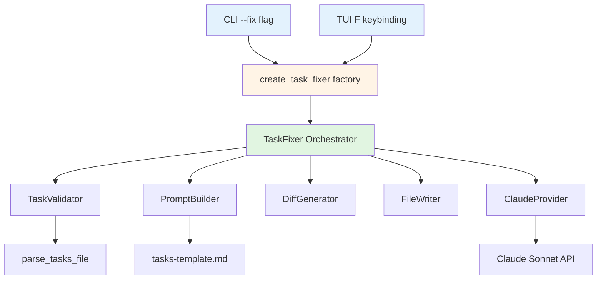

# Design Document

## Overview

The task auto-fix feature is a modular system that validates, fixes, and safely applies corrections to malformed tasks.md files using Claude Sonnet AI. The design follows SOLID principles with dependency injection, creating six isolated components in a new `task_fixer/` module that integrates seamlessly with existing TUI and CLI infrastructure.

## Steering Document Alignment

### Technical Standards (tech.md)
- **SOLID Principles**: Each component has single responsibility with clear interfaces
- **Dependency Injection**: All dependencies injected via constructors, no globals
- **Error Handling**: Custom exception hierarchy with structured error messages
- **Testing**: 80% minimum coverage with mocked dependencies
- **Code Metrics**: Max 500 lines/file, 50 lines/function

### Project Structure (structure.md)
- **Module Isolation**: New `task_fixer/` module under `src/spec_workflow_runner/`
- **Test Organization**: Tests mirror source structure in `tests/task_fixer/`
- **Integration Points**: Minimal coupling to existing TUI/CLI via well-defined interfaces
- **Factory Pattern**: Public API exposed through factory function in `__init__.py`

## Code Reuse Analysis

### Existing Components to Leverage
- **ClaudeProvider** (`providers.py`): Reuse existing AI provider abstraction for Claude Sonnet API calls
- **parse_tasks_file()** (`tui/task_parser.py`): Baseline for validation logic, pattern matching
- **Config** (`utils.py`): Configuration management, template paths, provider settings
- **ProviderCommand** (`providers.py`): Command building pattern for subprocess execution
- **Keybinding pattern** (`keybindings.py`): Handler return pattern `(bool, str | None)` for TUI integration

### Integration Points
- **TUI Keybindings** (`keybindings.py`): Add 'F' key handler that calls TaskFixer
- **CLI Arguments** (`cli.py`): Add `--fix` flag with handler function
- **Template System**: Load `.spec-workflow/templates/tasks-template.md` as reference format
- **File System**: Atomic file operations for safe writes with backup

## Architecture

The system uses a layered architecture with clear separation of concerns:



### Modular Design Principles
- **Single File Responsibility**: Each module handles one concern (validation, prompting, diffing, writing, orchestration)
- **Component Isolation**: Components depend on abstractions, not concrete implementations
- **Service Layer Separation**: Clear boundary between orchestration (fixer.py) and individual services
- **Utility Modularity**: Each utility (validator, diff generator, file writer) is independently testable

## Components and Interfaces

### Component 1: TaskValidator
- **Purpose:** Detect format issues in tasks.md files
- **Interfaces:**
  - `validate_file(file_path: Path) -> ValidationResult`
- **Dependencies:** None (uses standard library `re`)
- **Reuses:** `parse_tasks_file()` pattern from `task_parser.py`
- **Data Models:**
  ```python
  @dataclass(frozen=True)
  class ValidationIssue:
      line_number: int
      severity: Literal["error", "warning"]
      issue_type: str
      message: str
      context: str

  @dataclass(frozen=True)
  class ValidationResult:
      is_valid: bool
      issues: tuple[ValidationIssue, ...]
      task_count: int
  ```

### Component 2: PromptBuilder
- **Purpose:** Generate Claude prompts from template and malformed content
- **Interfaces:**
  - `build_prompt(context: PromptContext) -> str`
- **Dependencies:** Template file path (injected)
- **Reuses:** Template loading pattern from Config
- **Data Models:**
  ```python
  @dataclass(frozen=True)
  class PromptContext:
      malformed_content: str
      validation_issues: tuple[ValidationIssue, ...]
      template_content: str
      spec_name: str
  ```

### Component 3: DiffGenerator
- **Purpose:** Create human-readable diffs for confirmation
- **Interfaces:**
  - `generate_diff(original_content: str, fixed_content: str, ...) -> DiffResult`
- **Dependencies:** None (uses standard library `difflib`)
- **Reuses:** N/A (pure utility)
- **Data Models:**
  ```python
  @dataclass(frozen=True)
  class DiffResult:
      unified_diff: str
      changes_summary: str
      has_changes: bool
  ```

### Component 4: FileWriter
- **Purpose:** Safely write fixed content with backup
- **Interfaces:**
  - `write_with_backup(file_path: Path, content: str, create_backup: bool) -> WriteResult`
  - `restore_from_backup(backup_path: Path) -> bool`
- **Dependencies:** None (filesystem operations)
- **Reuses:** N/A (atomic file writing pattern)
- **Data Models:**
  ```python
  @dataclass(frozen=True)
  class WriteResult:
      success: bool
      backup_path: Path | None
      error_message: str | None
  ```

### Component 5: TaskFixer (Orchestrator)
- **Purpose:** Coordinate entire fix process with dependency injection
- **Interfaces:**
  - `fix_tasks_file(tasks_path: Path, spec_name: str, project_path: Path) -> FixResult`
  - `apply_fix(tasks_path: Path, fixed_content: str, create_backup: bool) -> WriteResult`
- **Dependencies:** Provider, Config, Validator, PromptBuilder, DiffGenerator, FileWriter (all injected)
- **Reuses:** Provider command building, subprocess execution pattern
- **Data Models:**
  ```python
  @dataclass(frozen=True)
  class FixResult:
      success: bool
      fixed_content: str | None
      validation_result: ValidationResult
      diff_result: DiffResult | None
      error_message: str | None
  ```

### Component 6: Factory Function
- **Purpose:** Create TaskFixer with all dependencies (public API)
- **Interfaces:**
  - `create_task_fixer(provider: Provider, config: Config) -> TaskFixer`
- **Dependencies:** N/A (creates dependencies)
- **Reuses:** Factory pattern similar to `create_provider()`

## Data Models

### ValidationIssue
```python
@dataclass(frozen=True)
class ValidationIssue:
    line_number: int          # Line where issue occurs
    severity: Literal["error", "warning"]  # Issue severity
    issue_type: str           # Category (e.g., "missing_checkbox", "invalid_task_id")
    message: str              # Human-readable description
    context: str              # Surrounding lines for context
```

### ValidationResult
```python
@dataclass(frozen=True)
class ValidationResult:
    is_valid: bool                       # Overall validation status
    issues: tuple[ValidationIssue, ...]  # All detected issues
    task_count: int                      # Number of valid tasks found

    @property
    def has_critical_issues(self) -> bool:
        return any(issue.severity == "error" for issue in self.issues)
```

### PromptContext
```python
@dataclass(frozen=True)
class PromptContext:
    malformed_content: str                   # Original tasks.md content
    validation_issues: tuple[ValidationIssue, ...]  # Issues to fix
    template_content: str                    # Reference template
    spec_name: str                           # Spec name for context
```

### DiffResult
```python
@dataclass(frozen=True)
class DiffResult:
    unified_diff: str          # Unified diff format output
    changes_summary: str       # E.g., "5 lines changed, 2 added, 1 removed"
    has_changes: bool          # Whether any changes exist
```

### WriteResult
```python
@dataclass(frozen=True)
class WriteResult:
    success: bool              # Write operation success
    backup_path: Path | None   # Path to backup file if created
    error_message: str | None  # Error details if failed
```

### FixResult
```python
@dataclass(frozen=True)
class FixResult:
    success: bool                          # Overall fix success
    fixed_content: str | None              # Corrected content if successful
    validation_result: ValidationResult    # Original validation results
    diff_result: DiffResult | None         # Diff if fixes generated
    error_message: str | None              # Error details if failed
```

## Error Handling

### Error Scenarios

1. **File Not Found**
   - **Handling:** Return error in FixResult, do not raise exception
   - **User Impact:** Footer message: "Error: tasks.md not found for spec 'name'"

2. **Invalid File Permissions**
   - **Handling:** Catch OSError during file operations, return WriteResult with error
   - **User Impact:** Error message: "Error: Cannot write to tasks.md (permission denied)"

3. **Claude Provider Failure**
   - **Handling:** Catch subprocess errors, wrap in ProviderError, return in FixResult
   - **User Impact:** Error message: "Error: Claude failed to generate fix: [details]"

4. **Invalid Fixed Content**
   - **Handling:** Validate fixed content before returning, reject if still invalid
   - **User Impact:** Error message: "Error: Claude produced invalid output"

5. **Disk Full / Write Failure**
   - **Handling:** Atomic write with rollback, preserve original file
   - **User Impact:** Error message: "Error: Failed to write file (disk full?)"

6. **User Cancellation**
   - **Handling:** Return early without applying fix, no exception
   - **User Impact:** Status message: "Fix cancelled by user"

### Custom Exceptions
```python
class TaskFixerError(Exception):
    """Base exception for task fixer errors."""

class ValidationError(TaskFixerError):
    """Raised when validation fails critically."""

class ProviderError(TaskFixerError):
    """Raised when AI provider fails."""

class FileWriteError(TaskFixerError):
    """Raised when file write fails."""
```

## Testing Strategy

### Unit Testing
- **Validator Tests:** Test with malformed/valid inputs, edge cases (empty files, only comments)
- **PromptBuilder Tests:** Verify prompt structure, template inclusion, issue formatting
- **DiffGenerator Tests:** Test identical content (no changes), various change types
- **FileWriter Tests:** Atomic writes, backup creation, permission errors, restore functionality
- **Fixer Tests:** Mock all dependencies, test orchestration flow, error handling at each stage

### Integration Testing
- **CLI Workflow:** Test `--fix` flag with valid/invalid specs, confirmation prompts, error messages
- **TUI Workflow:** Test 'F' keybinding with selection states, footer messages, blocking behavior
- **End-to-End:** Malformed file → validation → Claude call → diff → apply → verify result

### Test Fixtures
- `tests/task_fixer/fixtures/malformed_tasks.md` - Various format errors
- `tests/task_fixer/fixtures/valid_tasks.md` - Properly formatted tasks
- `tests/task_fixer/fixtures/expected_fixes.md` - Expected Claude output

### Coverage Requirements
- **Unit Tests:** 90% coverage for critical paths (validator, fixer orchestration)
- **Integration Tests:** 80% coverage for CLI/TUI handlers
- **Overall:** 85% minimum coverage for task_fixer module

## Implementation Notes

### Claude Prompt Template
```
You are a tasks.md format fixer. Fix malformed tasks.md following the template.

# Template Format (REFERENCE):
{template_content}

# Current Malformed Content:
{malformed_content}

# Validation Issues:
{issues_list}

# Instructions:
1. Fix all validation issues
2. Maintain original task intent
3. Follow template format exactly
4. Preserve task status ([ ], [x], [-])
5. Ensure proper numbering (1, 2, 2.1, 3, etc.)
6. Output ONLY corrected markdown
7. NO explanations or comments

# Corrected tasks.md:
```

### Atomic File Writing Pattern
```python
# 1. Create backup (if requested)
backup_path = file_path.with_suffix(file_path.suffix + '.backup')
shutil.copy2(file_path, backup_path)

# 2. Write to temporary file
temp_path = file_path.with_suffix('.tmp')
temp_path.write_text(content, encoding='utf-8')

# 3. Atomic rename
temp_path.replace(file_path)

# 4. Return backup path
return WriteResult(success=True, backup_path=backup_path, error_message=None)
```

### TUI Integration Pattern
```python
# In keybindings.py
def _handle_fix_tasks(self) -> tuple[bool, str | None]:
    """Fix tasks.md for selected spec (blocking)."""
    spec = self.app_state.selected_spec
    if not spec:
        return True, "Error: No spec selected"

    provider = ClaudeProvider(model="sonnet")
    fixer = create_task_fixer(provider, self.config)

    result = fixer.fix_tasks_file(...)  # Blocking

    if not result.success:
        return True, f"Error: {result.error_message}"

    # Show diff and confirm (simplified for initial implementation)
    return True, f"Fix ready: {result.diff_result.changes_summary}"
```

### CLI Integration Pattern
```python
# In cli.py
def _handle_fix_command(args: argparse.Namespace) -> int:
    """Handle --fix SPEC_NAME command."""
    config = load_config()
    provider = ClaudeProvider(model="sonnet")
    fixer = create_task_fixer(provider, config)

    result = fixer.fix_tasks_file(...)

    if not result.success:
        print(f"Error: {result.error_message}")
        return 1

    # Display diff
    print(result.diff_result.unified_diff)

    # Prompt for confirmation
    confirm = input("Apply fix? (y/n): ")
    if confirm.lower() == 'y':
        write_result = fixer.apply_fix(...)
        print(f"Fix applied. Backup: {write_result.backup_path}")
        return 0

    print("Fix cancelled")
    return 0
```
