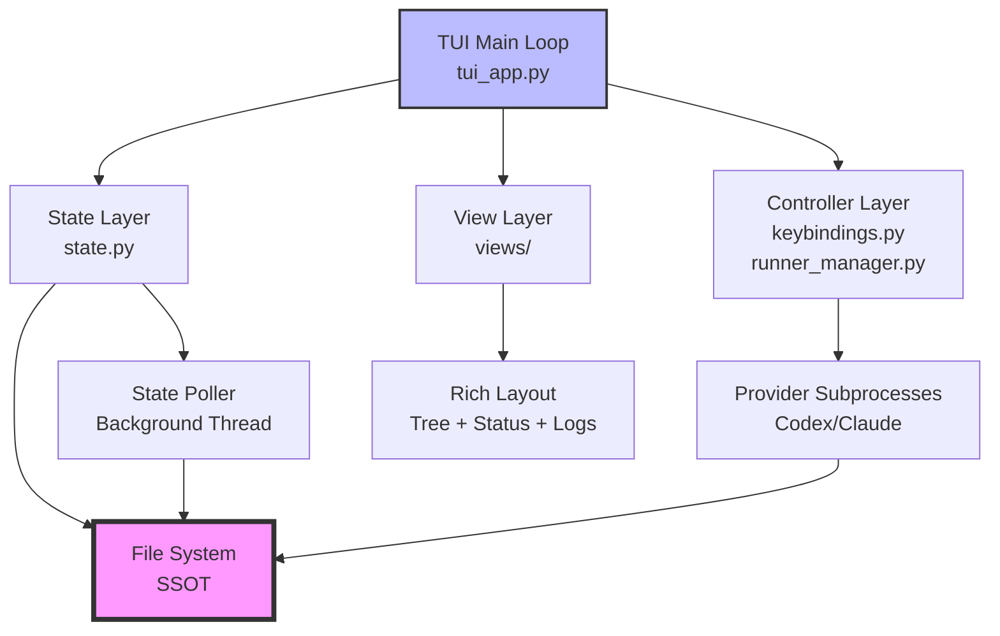
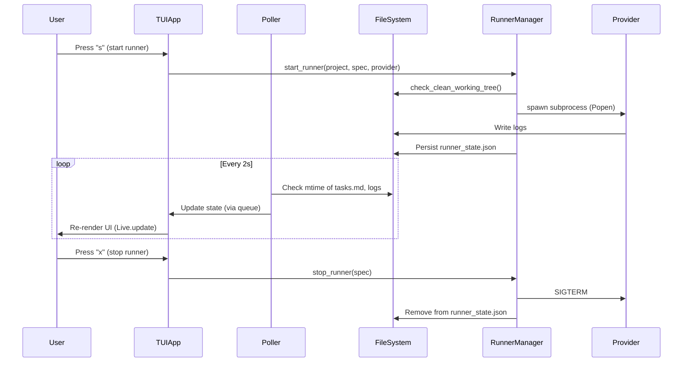

# Design Document

## Overview

The TUI Unified Runner is a terminal-based application built with Rich that consolidates project discovery, spec browsing, workflow control, and real-time monitoring into a single interface. It follows a three-layer architecture (State, Controller, View) with the file system as the single source of truth, using polling-based updates and background threads for subprocess management.

Key design principles:
- **SSOT**: File system (tasks.md, logs, git) is authoritative, not in-memory state
- **Separation of Concerns**: State reading, event handling, and rendering are isolated
- **Modular Views**: Rich components are composable and independently testable
- **Background Processing**: File polling and subprocess monitoring in separate threads
- **Graceful Degradation**: UI remains functional even if file reads fail (show cached data)

## Steering Document Alignment

### Technical Standards (tech.md)
- **Language**: Python 3.11+ with strict typing (`mypy --strict`)
- **Dependencies**: Rich 13.7+ (existing dependency), stdlib only (subprocess, threading, pathlib)
- **Architecture**: Event-driven with file system polling, three-layer design
- **Performance**: <16ms frame time, <500ms startup, <5% CPU idle overhead

### Project Structure (structure.md)
- **Module Organization**: Follows existing pattern of `src/spec_workflow_runner/`
- **Naming**: `snake_case` for files/functions, `PascalCase` for classes
- **Modularity**: Each view in separate file (`tree_view.py`, `status_panel.py`, `log_viewer.py`)
- **Reuse**: Leverages `utils.py`, `providers.py`, existing config/state readers

## Code Reuse Analysis

### Existing Components to Leverage
- **`utils.py`**:
  - `discover_projects()`: Project scanning with caching (reuse as-is)
  - `discover_specs()`: Spec enumeration (reuse)
  - `read_task_stats()`: Parse tasks.md for done/pending/in-progress (reuse)
  - `load_config()`: Config loading (reuse)
  - `check_clean_working_tree()`: Git precondition check (integrate into runner start)
  - `check_mcp_server_exists()`: MCP validation (integrate into runner start)
- **`providers.py`**:
  - `Provider` base class: Abstract interface for Codex/Claude (reuse)
  - `CodexProvider`, `ClaudeProvider`: Command builders (reuse for subprocess spawning)
  - `get_provider()`: Factory function (reuse)
- **`monitor.py`**:
  - `LogFollower` class: Tail log files with offset tracking (extract and reuse)
  - Dashboard rendering patterns: Adapt for TUI layout

### Integration Points
- **State Management**: Extend existing caching (`projects.json`) with runner state (`runner_state.json`)
- **Provider Subprocess**: Replace `subprocess.run()` in `run_tasks.py` with `Popen()` for background execution
- **Config Schema**: Add TUI-specific config keys (`tui_refresh_seconds`, `tui_log_tail_lines`)

## Architecture

### High-Level Architecture



### Component Layers

1. **State Layer** (`state.py`):
   - **Responsibility**: Read file system, parse data, expose state models
   - **Components**:
     - `ProjectState`: Project metadata (path, specs list)
     - `SpecState`: Spec metadata (tasks, runner status, log path)
     - `RunnerState`: Active runner info (PID, provider, start time)
     - `StatePoller`: Background thread polling files for changes (mtime checks)
   - **SSOT Sources**:
     - `tasks.md`: Task completion counts
     - `logs/*.log`: Provider output
     - `~/.cache/.../runner_state.json`: Persistent runner tracking
     - Git repo: Commit hashes (via `git log`)

2. **Controller Layer** (`runner_manager.py`, `keybindings.py`):
   - **Responsibility**: Handle events, manage subprocess lifecycle
   - **Components**:
     - `RunnerManager`: Start/stop provider subprocesses, monitor PIDs
     - `KeybindingHandler`: Map key presses to actions (navigation, start/stop)
     - `StateWriter`: Persist runner state to disk

3. **View Layer** (`views/`):
   - **Responsibility**: Render Rich components from state models
   - **Components**:
     - `TreeView`: Render project/spec tree with status badges
     - `StatusPanel`: Render selected spec status (tasks, runner info)
     - `LogViewer`: Render log tail with auto-scroll
     - `HelpPanel`: Keybinding reference
     - `FooterBar`: Status bar (active runners, errors)

### Modular Design Principles
- **Single File Responsibility**: Each view in separate file, each handles one UI concern
- **Component Isolation**: Views depend only on state models, not on each other
- **Service Layer Separation**: State reading (SSOT) is separate from state rendering (views)
- **Utility Modularity**: Shared helpers in `tui_utils.py` (e.g., format_duration, truncate_log)

### Data Flow



## Components and Interfaces

### Component 1: StatePoller (state.py)

- **Purpose:** Background thread that polls file system for changes, updates in-memory cache, notifies main loop
- **Interfaces:**
  ```python
  class StatePoller:
      def __init__(self, config: Config, update_queue: Queue[StateUpdate]):
          """Initialize poller with config and queue for publishing updates."""

      def start(self) -> None:
          """Start background thread polling at config.tui_refresh_seconds interval."""

      def stop(self) -> None:
          """Stop background thread gracefully."""

      def _poll_cycle(self) -> None:
          """Single poll cycle: check mtimes, read files, publish updates."""
  ```
- **Dependencies:** `Config`, `discover_projects`, `read_task_stats`, `pathlib`
- **Reuses:** `utils.discover_projects()`, `utils.read_task_stats()`
- **State Updates Published:**
  - `ProjectListUpdate`: Projects added/removed
  - `TaskStatsUpdate`: Task counts changed for spec
  - `LogUpdate`: New log lines available

### Component 2: RunnerManager (runner_manager.py)

- **Purpose:** Manage provider subprocess lifecycle (start, monitor, stop), persist state
- **Interfaces:**
  ```python
  class RunnerManager:
      def __init__(self, config: Config):
          """Initialize with config, load persisted state from runner_state.json."""

      def start_runner(self, project: Path, spec_name: str, provider: Provider) -> RunnerState:
          """Start provider subprocess, persist state, return RunnerState."""
          # Validates: clean working tree, MCP servers
          # Spawns: Popen with pipes, non-blocking
          # Persists: runner_state.json

      def stop_runner(self, runner_id: str, timeout: int = 5) -> None:
          """Send SIGTERM, wait timeout, SIGKILL if needed, remove from state."""

      def get_active_runners(self) -> list[RunnerState]:
          """Return list of currently running specs."""

      def check_runner_health(self, runner_id: string) -> RunnerStatus:
          """Check if PID is still running, return status (Running/Crashed/Stopped)."""
  ```
- **Dependencies:** `Provider`, `Config`, `subprocess.Popen`, `psutil` (for PID checks)
- **Reuses:** `providers.Provider`, `utils.check_clean_working_tree()`, `utils.check_mcp_server_exists()`
- **State File:** `~/.cache/spec-workflow-runner/runner_state.json`
  ```json
  {
    "runners": [
      {
        "id": "uuid-1234",
        "project_path": "/home/user/repos/my-project",
        "spec_name": "my-spec",
        "provider": "codex",
        "model": "claude-sonnet-4.5",
        "pid": 12345,
        "start_time": "2025-01-15T10:30:00Z",
        "config_hash": "abc123"
      }
    ]
  }
  ```

### Component 3: TreeView (views/tree_view.py)

- **Purpose:** Render hierarchical tree of projects and specs with status badges
- **Interfaces:**
  ```python
  def render_tree(
      projects: list[ProjectState],
      selected_path: tuple[str, str | None],  # (project_name, spec_name or None)
      filter_text: str = ""
  ) -> Tree:
      """Build Rich Tree with projects as roots, specs as children, badges as labels."""
  ```
- **Dependencies:** `rich.tree.Tree`, `ProjectState`, `SpecState`
- **Reuses:** N/A (new component)
- **Rendering Details:**
  - Project nodes: Bold, with spec count (e.g., "my-project (5 specs)")
  - Spec nodes: Task ratio (e.g., "3/10 tasks"), status badge
  - Status badges:
    - ✓ (green) if all tasks done
    - ▶ (yellow) if runner active
    - ⚠ (red) if runner crashed
  - Highlight selected node with `[reverse]` style

### Component 4: StatusPanel (views/status_panel.py)

- **Purpose:** Render detailed status for selected spec (tasks, runner info)
- **Interfaces:**
  ```python
  def render_status_panel(
      spec: SpecState | None,
      runner: RunnerState | None
  ) -> Panel:
      """Build Rich Panel with task progress, runner details, git status."""
  ```
- **Dependencies:** `rich.panel.Panel`, `rich.progress.Progress`, `SpecState`, `RunnerState`
- **Reuses:** Patterns from `monitor.build_dashboard()`
- **Rendering Details:**
  - If no spec selected: "Select a spec from the tree"
  - If spec selected:
    - Header: Project path, spec name
    - Body:
      - Task counts table (Total/Done/In Progress/Pending)
      - Progress bar (done/total)
      - If runner active:
        - Provider and model
        - Running duration (HH:MM:SS)
        - PID
        - Last commit (hash + message)

### Component 5: LogViewer (views/log_viewer.py)

- **Purpose:** Render tail of log file with auto-scroll, syntax highlighting
- **Interfaces:**
  ```python
  class LogViewer:
      def __init__(self, max_lines: int = 200):
          """Initialize with max line buffer size."""

      def update_log_path(self, log_path: Path | None) -> None:
          """Switch to new log file (reset offset)."""

      def poll_log(self) -> None:
          """Read new lines from log file, append to buffer."""

      def render_panel(self, auto_scroll: bool = True) -> Panel:
          """Render log tail in scrollable panel."""
  ```
- **Dependencies:** `rich.panel.Panel`, `rich.text.Text`, `pathlib`
- **Reuses:** `monitor.LogFollower` (extract to shared utility)
- **Rendering Details:**
  - Title: "Logs – {filename}" or "Waiting for logs..."
  - Body: Last N lines (configurable, default 200)
  - Auto-scroll: Jump to bottom on new lines (unless user scrolled up)
  - Syntax: Detect ANSI codes, preserve colors

### Component 6: KeybindingHandler (keybindings.py)

- **Purpose:** Map keyboard input to controller actions
- **Interfaces:**
  ```python
  class KeybindingHandler:
      def __init__(self, app_state: AppState, runner_manager: RunnerManager):
          """Initialize with app state and runner manager."""

      def handle_key(self, key: str) -> bool:
          """Process key press, return True if handled, False otherwise."""
  ```
- **Dependencies:** `AppState` (navigation state), `RunnerManager`
- **Reuses:** N/A (new component)
- **Keybindings:**
  - Navigation: ↑/↓ (move), Enter (select/expand), g/G (jump top/bottom)
  - Filtering: `/` (enter filter), Esc (clear filter), `u` (unfinished only)
  - Runner control: `s` (start), `x` (stop), `r` (restart)
  - View control: `l` (toggle logs), `L` (re-enable auto-scroll), `a` (all active)
  - Meta: `?` (help), `c` (config), `q` (quit)

## Data Models

### ProjectState
```python
@dataclass
class ProjectState:
    """State of a single project discovered under repos_root."""
    path: Path                    # Absolute path to project directory
    name: str                     # Project directory name
    specs: list[SpecState]        # List of specs in project
    last_scan: float              # Timestamp of last scan (for cache invalidation)
```

### SpecState
```python
@dataclass
class SpecState:
    """State of a single spec within a project."""
    name: str                     # Spec directory name
    path: Path                    # Absolute path to spec directory
    tasks: TaskStats              # Done/pending/in-progress counts (from utils.py)
    runner: RunnerState | None    # Active runner for this spec, or None
    log_path: Path | None         # Path to latest log file, or None
    last_commit: str | None       # Last commit hash since runner start, or None
```

### RunnerState
```python
@dataclass
class RunnerState:
    """State of an active or stopped runner subprocess."""
    id: str                       # Unique identifier (UUID)
    project_path: Path            # Project being worked on
    spec_name: str                # Spec being executed
    provider: str                 # Provider name (e.g., "codex", "claude")
    model: str                    # Model being used (e.g., "claude-sonnet-4.5")
    pid: int                      # Process ID of provider subprocess
    start_time: datetime          # When runner was started
    status: RunnerStatus          # Running, Stopped, Crashed, Completed
    exit_code: int | None         # Exit code if stopped/crashed
    config_hash: str              # Hash of config.json at start (detect stale state)
```

### RunnerStatus (Enum)
```python
class RunnerStatus(Enum):
    """Status of a runner subprocess."""
    RUNNING = "running"          # Process is active
    STOPPED = "stopped"          # User stopped or never started
    CRASHED = "crashed"          # Process exited with non-zero code
    COMPLETED = "completed"      # All tasks done, exited cleanly
```

### AppState
```python
@dataclass
class AppState:
    """Global application state (navigation, UI state)."""
    projects: list[ProjectState]      # All discovered projects
    selected_project: str | None      # Currently selected project name
    selected_spec: str | None         # Currently selected spec name
    filter_text: str                  # Active filter string
    filter_mode: bool                 # True if in filter input mode
    log_auto_scroll: bool             # True if logs auto-scroll to tail
    show_unfinished_only: bool        # True if filtering to unfinished specs
```

## Error Handling

### Error Scenarios

1. **Scenario: Config file missing or malformed**
   - **Handling**: Exit with error message: "Config not found at {path}" or "Invalid JSON in config"
   - **User Impact**: TUI does not start, user must fix config

2. **Scenario: No projects found under repos_root**
   - **Handling**: Display in tree view: "No projects with .spec-workflow found under {repos_root}"
   - **User Impact**: Empty tree, user checks repos_root config

3. **Scenario: tasks.md file is missing for spec**
   - **Handling**: Display "No tasks.md" in status panel, allow runner start (will fail gracefully)
   - **User Impact**: Visible in UI, but non-blocking

4. **Scenario: Provider subprocess fails to start**
   - **Handling**: Mark runner as Crashed, display error in status panel with stderr tail
   - **User Impact**: Clear failure indication, user can inspect logs

5. **Scenario: Provider subprocess crashes during execution**
   - **Handling**: Detect via PID check (polling), mark as Crashed, preserve stderr in logs
   - **User Impact**: Status updates to Crashed, user can view logs and restart

6. **Scenario: runner_state.json is corrupted**
   - **Handling**: Log warning, delete file, continue with empty state
   - **User Impact**: Lose active runner tracking (orphan processes possible), but TUI remains functional

7. **Scenario: File system read error (e.g., permission denied on tasks.md)**
   - **Handling**: Log error, display last successfully read state (graceful degradation)
   - **User Impact**: Stale data shown, but TUI does not crash

8. **Scenario: Terminal too small (< 80x24)**
   - **Handling**: Display warning in footer: "Terminal too small (current: 70x20, min: 80x24)"
   - **User Impact**: Layout may break, user resizes terminal

## Testing Strategy

### Unit Testing
- **State Layer**:
  - Test `read_task_stats()` with various tasks.md formats (existing tests in utils_test.py)
  - Test `RunnerState` serialization to/from JSON
  - Test `StatePoller` mtime detection (mock file system)
- **Controller Layer**:
  - Test `RunnerManager.start_runner()` validates preconditions (mock checks)
  - Test `RunnerManager.stop_runner()` sends correct signals (mock subprocess)
  - Test `KeybindingHandler.handle_key()` maps keys to actions
- **View Layer**:
  - Test `render_tree()` produces correct Rich Tree structure (snapshot tests)
  - Test `render_status_panel()` formats runner info correctly
  - Test `LogViewer.poll_log()` handles file rotation (mock file system)

### Integration Testing
- **End-to-End TUI Test**:
  1. Set up test project with .spec-workflow and tasks.md
  2. Launch TUI in test mode (mock terminal, inject key presses)
  3. Inject key sequence: Navigate to spec, press "s", select provider
  4. Mock subprocess spawn, verify runner_state.json created
  5. Inject "x" to stop, verify SIGTERM sent
  6. Verify UI updates correctly (assert on rendered output)
- **File System Integration**:
  - Test with real tasks.md file modifications (watch for updates)
  - Test log file tailing with real log writes
  - Test git commit detection with real git repository

### Manual Testing (TUI-specific)
- **Visual Testing**:
  - Test on multiple terminals (xterm, iTerm2, Alacritty)
  - Test with 256-color vs truecolor
  - Test resize behavior (shrink to 80x24, expand to 200x60)
- **Performance Testing**:
  - Test with 100 projects, 50 specs each (measure startup time)
  - Test with 5 concurrent runners (measure CPU/memory)
  - Test log tail with large files (10MB+) (measure render lag)
- **Stress Testing**:
  - Rapidly start/stop runners (check for race conditions)
  - Kill provider process externally (check recovery)
  - Corrupt runner_state.json mid-run (check error handling)

### Test Coverage Goals
- **State Layer**: 90% (critical for SSOT correctness)
- **Controller Layer**: 85% (important for subprocess safety)
- **View Layer**: 70% (mostly rendering, harder to test)
- **Overall**: 80% minimum
